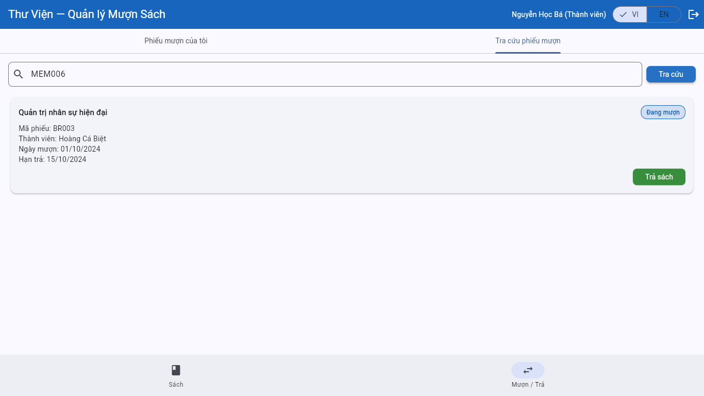
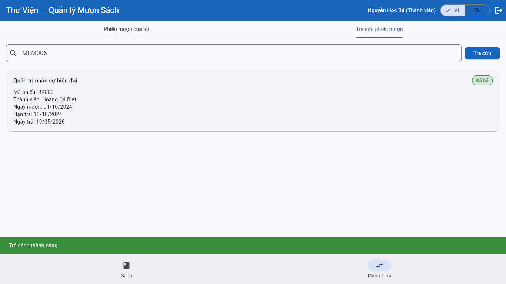
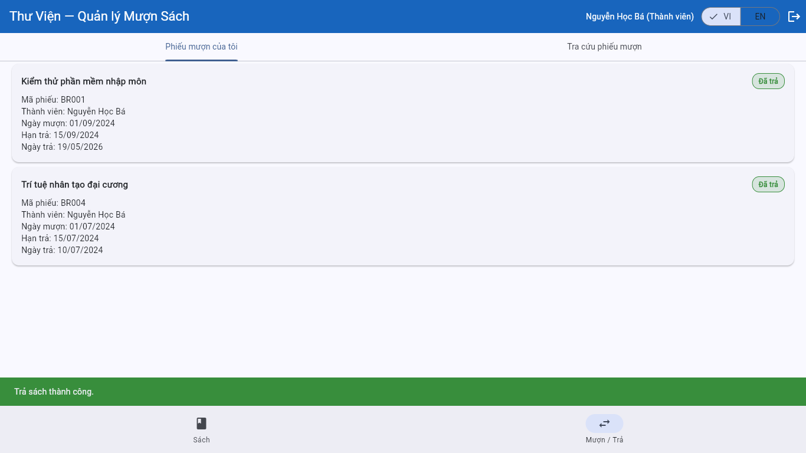

# Bug Reports

> **Instructions**: For each TC that **Fails** during execution, write a complete Bug Report in this file. See [examples/sample-bug-report.md](../examples/sample-bug-report.md) for how to write one.

---

## BUG-001: Member Can Borrow More Than the 3-Book Limit at the Same Time

**1. General Information**
- **Failed Test Case**: TC-17
- **Related Requirement (REQ)**: REQ-04 (Borrowing Limit)
- **Severity**: High
  *(Explanation: This bug directly violates the core business flow, allowing members to hoard all books in the library, severely impacting library operations.)*
- **Environment**: Chrome / Windows (https://stqa.rbc.vn)

**2. Steps to Reproduce**
1. Open the browser and navigate to the system at `https://stqa.rbc.vn`.
2. Log in with member account `ba.nguyen@email.com` (password: `password123`).
3. Confirm in the "Borrow/Return" tab that this member already has 1 book currently borrowed (BR001 — BOOK003).
4. Switch to the "Books" tab and borrow 2 more available books (e.g., BOOK001, BOOK002) to reach a total of 3.
5. Continue pressing the (+) button to borrow a 4th book (e.g., `BOOK004` or `BOOK005`).
6. In the confirmation dialog, click "Borrow".

**3. Actual Result**
The system displays a **"Borrow successful!"** message (green) and adds the 4th book to the member's active borrow list. No warning or blocking action is triggered by the system.


**4. Expected Result**
Per REQ-04, the system must reject the request to borrow the 4th book and display an error message indicating the 3-book borrowing limit has been exceeded.

**5. Recommendation**
The control logic should implement a `currentBorrowedBooksCount >= 3` check before executing the borrow function. The Borrow button should also be disabled if the user has already reached the limit.

---

## BUG-002: Wrong Error Message When a "Suspended" Account Tries to Borrow a Book

**1. General Information**
- **Failed Test Case**: TC-15
- **Related Requirement (REQ)**: REQ-04 (Error message must accurately describe the rejection reason: "suspended ≠ expired")
- **Severity**: Medium
  *(Explanation: The book-borrowing restriction works correctly, but the wrong message misleads the user about their account status. This violates the specific requirement in SRS REQ-04.)*
- **Environment**: Chrome / Windows (https://stqa.rbc.vn)

**2. Steps to Reproduce**
1. Open the browser and navigate to the system at `https://stqa.rbc.vn`.
2. Log in with the **Suspended** member account: `cu.le@email.com` (password: `password123`).
3. Confirm the login is successful (able to reach the main page).
4. Switch to the "Books" tab.
5. Press the (+) button to borrow an "Available" book (e.g., `BOOK001`).
6. In the confirmation dialog, click "Borrow".

**3. Actual Result**
The system correctly rejects the borrow action, but displays the following error message:
> **"Member has expired. Cannot borrow book."**

This message belongs to an **Expired (MEM005)** account, not a **Suspended (MEM004)** account. These two statuses are entirely different from a business logic perspective.


**4. Expected Result**
Per SRS REQ-04: *"Error messages must accurately describe the rejection reason (suspended ≠ expired)"*.
The system must display a distinguishing message, for example: **"Account is currently suspended. Cannot borrow book."**

**5. Recommendation**
Review the error message display logic for the borrow feature. Separate the condition checks for `status == "suspended"` and `status == "expired"` to return the correct corresponding message content.

---

## BUG-003: Email Validation Logic Is Broken — Add Member Feature Behaves Completely Incorrectly

**1. General Information**
- **Failed Test Cases**: TC-21, TC-22, TC-23
- **Related Requirement (REQ)**: REQ-07 (Member Management — Add New Member)
- **Severity**: Critical
  *(Explanation: The email validation logic is completely reversed — it rejects valid emails while accepting invalid ones. The add member feature cannot be used for its intended purpose, seriously affecting data quality and library operations.)*
- **Environment**: Chrome / Windows (https://stqa.rbc.vn)

**2. Bug Manifestations (3 cases sharing the same root cause)**

**Case A — TC-21: Valid email is rejected**

Steps to reproduce:
1. Log in as Librarian → "Members" tab → Click "+".
2. Fill in: Name=`Nguyen Test`, Email=`testnewuser99@gmail.com`, Phone=`0901234567`.
3. Click **"Add Member"**.

Actual result: The system shows **"Invalid email."** (red) — while the email is completely valid per the SRS (contains `@` and `.` in the domain).


---

**Case B — TC-22: Invalid email is accepted**

Steps to reproduce:
1. Log in as Librarian → "Members" tab → Click "+".
2. Fill in: Name=`Test Invalid Email`, Email=`new@gmail` *(missing `.` in domain — invalid per SRS)*, Phone=`0901234567`.
3. Click **"Add Member"**.

Actual result: The system **accepts** and displays **"Member added successfully! Code: MEM007"** — a new member is created with an invalid email.


---

**Case C — TC-23: Duplicate email reports the wrong error**

Steps to reproduce:
1. Log in as Librarian → "Members" tab → Click "+".
2. Fill in: Name=`Nguyen Duplicate Email`, Email=`librarian@library.com`, Phone=`0901234567`.
3. Click **"Add Member"**.

Actual result: The system shows **"Invalid email."** instead of a duplicate email error. `librarian@library.com` is a valid email per the SRS and already exists in the seed data, so the correct error should be about duplicate email.


**3. Root Cause Analysis**
All three manifestations share the same root cause: **the email regex/validator logic is incorrect** — the email format validation condition does not match the SRS and runs before the duplicate email check, resulting in:
- A correctly formatted email → treated as invalid → rejected
- An incorrectly formatted email → treated as valid → accepted
- A duplicate email that contains `.` in the domain → reported as "Invalid email" before the system checks for duplication

**4. Expected Result**
Per SRS REQ-07:
- **Valid** email (contains `@` AND `.` in domain, e.g., `user@domain.com`) → **Member created successfully**.
- **Invalid** email (missing `@` or missing `.` in domain, e.g., `new@gmail`) → **Reject, show format error**.
- **Duplicate** email (e.g., `librarian@library.com`) → **Reject, show duplicate email error**.

**5. Recommendation**
Fix the email validation function to match the SRS rules, then check for duplicate emails in the existing data. A standard regex should be used to validate the email format:

```regex
^[^\s@]+@[^\s@]+\.[^\s@]+$
```

*Explanation of the pattern above (this is Regex code, not a font error):*
- `^[^\s@]+`: Starts with characters that are not whitespace and do not contain `@`.
- `@`: Must contain `@` in the middle.
- `[^\s@]+`: Followed by the domain name without whitespace or `@`.
- `\.`: Must contain a `.` after the domain name.
- `[^\s@]+$`: Ends with the domain extension (e.g., `.com`, `.vn`) without whitespace or `@`.

Alternatively, a standard email validation package (such as `email_validator` in Flutter/Dart) configured correctly can be used. A `trim()` function should also be applied to strip leading/trailing whitespace from the email string before validation, to prevent errors caused by users accidentally copying extra spaces. Retesting should cover all three groups: valid emails, emails missing `.` in the domain, and already-existing emails.

---

## BUG-004: Member Can Look Up Another Member's Borrowing Slip

**1. General Information**
- **Failed Test Case**: TC-27
- **Related Requirement (REQ)**: REQ-08 (Members can only view their own borrowing slips)
- **Severity**: High
  *(Explanation: This bug exposes the borrowing history of other members, directly violating the authorization requirement in the SRS.)*
- **Environment**: Chrome / Windows (https://stqa.rbc.vn)
- **Related**: BUG-005 (by viewing another member's slip, a member can proceed to return it on their behalf)

**2. Steps to Reproduce**
1. Refresh the page to reset data.
2. Log in with member account `ba.nguyen@email.com` (MEM002), password `password123`.
3. Go to the **Borrow / Return** tab.
4. Select **Look Up Borrowing Slip**.
5. Enter another member's ID: `MEM006`.
6. Click **Look Up**.

**3. Actual Result**
The system displays slip `BR003` belonging to member `MEM006` (Hoang Ca Biet), including book information `Modern Human Resource Management`, borrow date, due date, status, and a **Return Book** button.



**4. Expected Result**
Per REQ-08, members may only view their own borrowing slips. The system must reject or not display any data when MEM002 looks up MEM006's slip.

**5. Recommendation**
Implement an access control check when looking up borrowing slips. If the current user is a Member, the system should only allow viewing `memberId` values that match the currently logged-in account. Only the Librarian should be able to look up slips for all members.

---

## BUG-005: Member Can Return Another Member's Borrowing Slip

**1. General Information**
- **Failed Test Case**: TC-28
- **Related Requirement (REQ)**: REQ-08 (authorization to view slips), REQ-05 (members can only return books they are currently borrowing)
- **Severity**: Critical
  *(Explanation: The member not only views another member's slip but also changes the slip/book status in the current session. This does not merely corrupt borrowing history — it creates a loophole where a user can deliberately "release" a popular book being held by someone else, making it "Available" so they can immediately borrow it. This bug directly and severely impacts library operations.)*
- **Environment**: Chrome / Windows (https://stqa.rbc.vn)
- **Related**: BUG-004 (the slip lookup bug is the prerequisite for the unauthorized return bug)

**2. Steps to Reproduce**
1. Refresh the page to reset data.
2. Log in with member account `ba.nguyen@email.com` (MEM002), password `password123`.
3. Go to the **Borrow / Return** tab.
4. Select **Look Up Borrowing Slip**.
5. Enter another member's ID: `MEM006`, click **Look Up**.
6. On slip `BR003` belonging to MEM006, click **Return Book**.

**3. Actual Result**
The system allows MEM002 to return slip `BR003` of MEM006, displaying **"Book returned successfully."**. The slip changes to **Returned** status with return date `19/05/2026`, confirming that data in the current session has been updated.



**4. Expected Result**
Per REQ-05 and REQ-08, members may only return books/slips they are currently borrowing. The system must reject the return action for slip `BR003` because it belongs to MEM006, not MEM002.

**5. Recommendation**
Hide or disable the **Return Book** button for slips that do not belong to the currently logged-in member. Additionally, the return book handler must enforce an authorization check at the business logic layer, not just relying on hiding/showing the button in the UI.

---

## BUG-006: No Overdue Warning Displayed When Returning an Overdue Book

**1. General Information**
- **Failed Test Case**: TC-19
- **Related Requirement (REQ)**: REQ-05 (If returned overdue → the system must display an overdue warning)
- **Severity**: Medium
  *(Explanation: The system still returns the book successfully, but does not display an overdue warning as required by the SRS, leaving the user/librarian unaware of the due date violation.)*
- **Environment**: Chrome / Windows (https://stqa.rbc.vn)

**2. Steps to Reproduce**
1. Refresh the page to reset data.
2. Log in with member account `ba.nguyen@email.com` (MEM002), password `password123`.
3. Go to the **Borrow / Return** tab.
4. Find slip `BR001` (`BOOK003`) with due date `15/09/2024`, which is past the test execution date.
5. Click **Return Book**.

**3. Actual Result**
The system returns the book successfully and only displays **"Book returned successfully."**. No overdue warning is shown even though slip `BR001` is past its due date.



**4. Expected Result**
Per REQ-05, when returning an overdue book, the system may still complete the return successfully but **must display an overdue warning**.

**5. Recommendation**
When processing a book return, the system should compare the return date against `dueDate`. If the return date > due date, the result notification must include a clear overdue warning, for example: **"Book returned successfully. The borrowing slip is overdue."**

---
