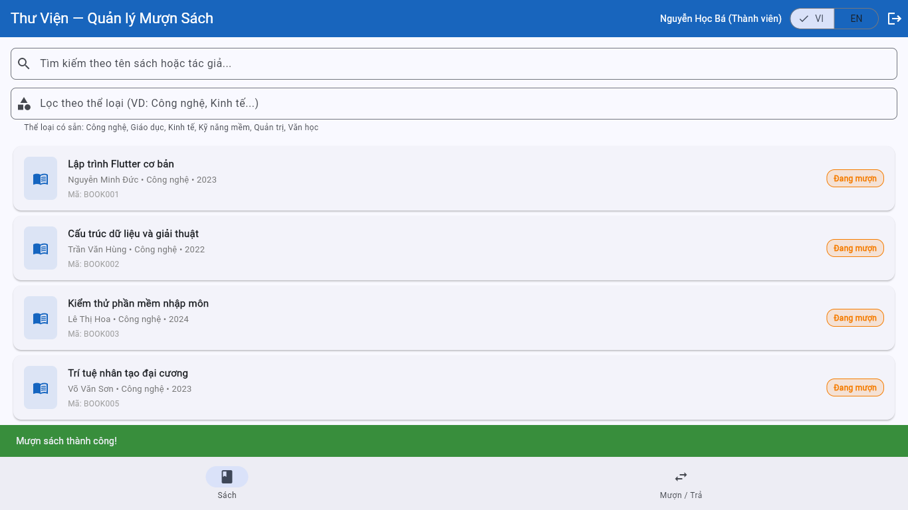
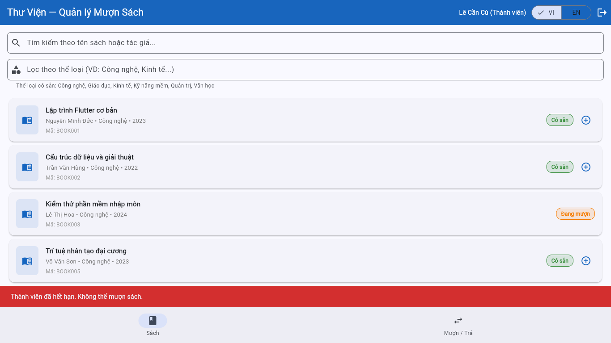
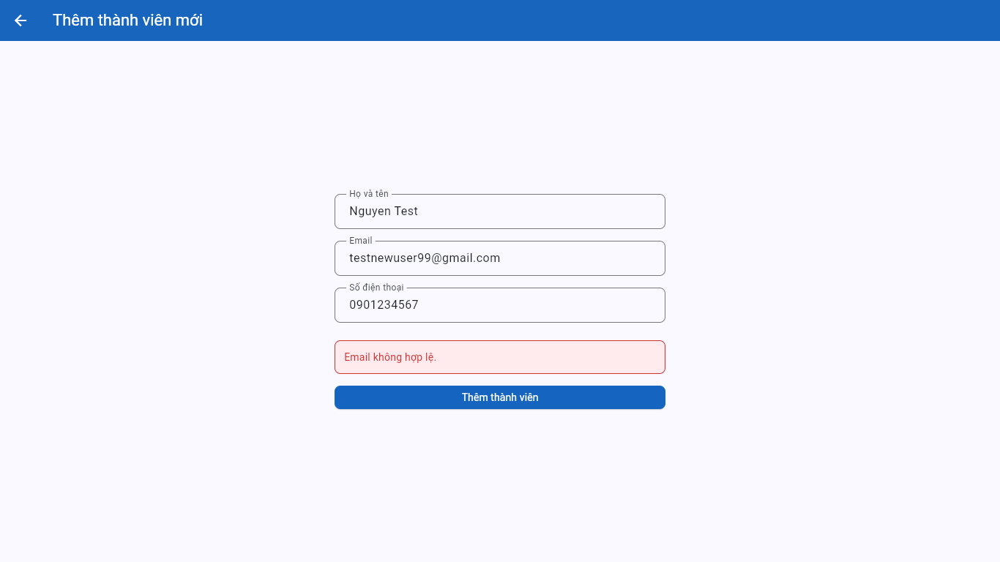

# Bug Reports — Báo cáo lỗi

> **Hướng dẫn**: Với mỗi TC bị **Fail** ở bước thực thi, hãy viết một Bug Report hoàn chỉnh vào file này. Xem [examples/sample-bug-report.md](../examples/sample-bug-report.md) để biết cách viết.

---

## BUG-001: Thành viên có thể mượn quá giới hạn 3 cuốn sách cùng lúc

**1. Thông tin chung**
- **Test Case bị Fail**: TC-17
- **Yêu cầu (REQ) liên quan**: REQ-04 (Giới hạn mượn sách)
- **Mức độ nghiêm trọng (Severity)**: High
  *(Giải thích: Lỗi này vi phạm trực tiếp luồng nghiệp vụ cốt lõi, khiến thành viên có thể gom hết sách của thư viện, ảnh hưởng nghiêm trọng đến vận hành)*
- **Môi trường**: Chrome / Windows (https://stqa.rbc.vn)

**2. Các bước tái hiện (Steps to Reproduce)**
1. Mở trình duyệt và truy cập hệ thống tại `https://stqa.rbc.vn`.
2. Đăng nhập bằng tài khoản Thành viên `ba.nguyen@email.com` (mật khẩu: `password123`).
3. Xác nhận ở Tab "Mượn/Trả" rằng thành viên này đã có sẵn 1 cuốn sách đang mượn (BR001 — BOOK003).
4. Chuyển sang Tab "Sách", mượn thêm 2 cuốn sách có sẵn (VD: BOOK001, BOOK002) để đạt tổng 3 cuốn.
5. Tiếp tục nhấn nút (+) để mượn thêm cuốn thứ 4 (Ví dụ: `BOOK004` hoặc `BOOK005`).
6. Trong hộp thoại xác nhận, nhấn "Mượn".

**3. Kết quả thực tế (Actual Result)**
Hệ thống hiển thị thông báo **"Mượn sách thành công!"** (màu xanh) và thêm cuốn sách thứ 4 vào danh sách đang mượn của thành viên. Không có bất kỳ cảnh báo hay ngăn chặn nào từ hệ thống.



**4. Kết quả mong đợi (Expected Result)**
Theo REQ-04, hệ thống phải từ chối yêu cầu mượn cuốn thứ 4 và hiển thị thông báo lỗi vượt quá giới hạn 3 cuốn sách.

**5. Đề xuất / Khuyến nghị (Recommendation)**
Logic điều khiển cần thực hiện kiểm tra `currentBorrowedBooksCount >= 3` trước khi thực thi hàm mượn sách. Nút bấm Mượn sách cũng nên bị vô hiệu hóa (disabled) nếu người dùng đã đạt giới hạn.

---

## BUG-002: Thông báo lỗi sai khi tài khoản "Tạm ngưng" cố gắng mượn sách

**1. Thông tin chung**
- **Test Case bị Fail**: TC-15
- **Yêu cầu (REQ) liên quan**: REQ-04 (Thông báo lỗi phải mô tả đúng lý do từ chối: "tạm ngưng ≠ hết hạn")
- **Mức độ nghiêm trọng (Severity)**: Medium
  *(Giải thích: Chức năng ngăn chặn mượn sách hoạt động đúng, nhưng thông báo sai gây hiểu lầm cho người dùng về trạng thái tài khoản của họ. Vi phạm yêu cầu cụ thể trong SRS REQ-04.)*
- **Môi trường**: Chrome / Windows (https://stqa.rbc.vn)

**2. Các bước tái hiện (Steps to Reproduce)**
1. Mở trình duyệt và truy cập hệ thống tại `https://stqa.rbc.vn`.
2. Đăng nhập bằng tài khoản Thành viên **Tạm ngưng**: `cu.le@email.com` (mật khẩu: `password123`).
3. Xác nhận đăng nhập thành công (vào được trang chính).
4. Chuyển sang Tab "Sách".
5. Nhấn nút (+) để mượn một cuốn sách có trạng thái "Có sẵn" (Ví dụ: `BOOK001`).
6. Trong hộp thoại xác nhận, nhấn "Mượn".

**3. Kết quả thực tế (Actual Result)**
Hệ thống từ chối mượn sách (đúng), nhưng hiển thị thông báo lỗi:
> **"Thành viên đã hết hạn. Không thể mượn sách."**

Đây là thông báo dành cho tài khoản **Hết hạn (MEM005)**, không phải cho tài khoản **Tạm ngưng (MEM004)**. Hai trạng thái này hoàn toàn khác nhau về mặt nghiệp vụ.



**4. Kết quả mong đợi (Expected Result)**
Theo SRS REQ-04: *"Thông báo lỗi phải mô tả **đúng lý do** từ chối (tạm ngưng ≠ hết hạn)"*.
Hệ thống phải hiển thị thông báo phân biệt rõ trạng thái, ví dụ: **"Tài khoản đang bị tạm ngưng. Không thể mượn sách."**

**5. Đề xuất / Khuyến nghị (Recommendation)**
Kiểm tra lại logic hiển thị thông báo lỗi cho chức năng mượn sách. Cần phân tách điều kiện kiểm tra `status == "suspended"` (tạm ngưng) và `status == "expired"` (hết hạn) để trả về đúng nội dung thông báo tương ứng.

---

## BUG-003: Logic xác thực email (email validation) bị lỗi — chức năng Thêm thành viên hoạt động sai hoàn toàn

**1. Thông tin chung**
- **Test Case bị Fail**: TC-21, TC-22, TC-23
- **Yêu cầu (REQ) liên quan**: REQ-07 (Quản lý thành viên — Thêm thành viên mới)
- **Mức độ nghiêm trọng (Severity)**: Critical
  *(Giải thích: Logic validation email bị đảo ngược hoàn toàn — từ chối email hợp lệ trong khi chấp nhận email không hợp lệ. Chức năng thêm thành viên không thể dùng đúng mục đích, ảnh hưởng nghiêm trọng đến chất lượng dữ liệu và hoạt động thư viện.)*
- **Môi trường**: Chrome / Windows (https://stqa.rbc.vn)

**2. Biểu hiện lỗi (3 trường hợp cùng một root cause)**

**Trường hợp A — TC-21: Email hợp lệ bị từ chối**

Các bước tái hiện:
1. Đăng nhập Thủ thư → Tab "Thành viên" → Nhấn nút "+".
2. Điền: Tên=`Nguyễn Test`, Email=`testnewuser99@gmail.com`, SĐT=`0901234567`.
3. Nhấn **"Thêm thành viên"**.

Kết quả thực tế: Hệ thống báo lỗi **"Email không hợp lệ."** (màu đỏ) — trong khi email hoàn toàn hợp lệ theo SRS (có `@` và có `.` trong domain).



---

**Trường hợp B — TC-22: Email không hợp lệ được chấp nhận**

Các bước tái hiện:
1. Đăng nhập Thủ thư → Tab "Thành viên" → Nhấn nút "+".
2. Điền: Tên=`Test Invalid Email`, Email=`new@gmail` *(thiếu `.` trong domain — không hợp lệ theo SRS)*, SĐT=`0901234567`.
3. Nhấn **"Thêm thành viên"**.

Kết quả thực tế: Hệ thống **chấp nhận** và hiển thị **"Thêm thành viên thành công! Mã: MEM007"** — thành viên mới được tạo với email không hợp lệ.


---

**Trường hợp C — TC-23: Email đã tồn tại bị báo sai lỗi**

Các bước tái hiện:
1. Đăng nhập Thủ thư → Tab "Thành viên" → Nhấn nút "+".
2. Điền: Tên=`Nguyễn Trùng Email`, Email=`librarian@library.com`, SĐT=`0901234567`.
3. Nhấn **"Thêm thành viên"**.

Kết quả thực tế: Hệ thống báo lỗi **"Email không hợp lệ."** thay vì báo email đã tồn tại. Email `librarian@library.com` là email hợp lệ theo SRS và đã tồn tại trong seed data, nên lỗi đúng phải là lỗi trùng email.


**3. Phân tích root cause**
Ba biểu hiện trên cùng một nguyên nhân: **logic regex/validator email bị sai** — điều kiện kiểm tra định dạng email không đúng với SRS và được chạy trước kiểm tra trùng email, dẫn đến:
- Email đúng chuẩn → bị coi là sai → từ chối
- Email sai chuẩn → bị coi là đúng → chấp nhận
- Email đã tồn tại nhưng có dấu `.` trong domain → bị báo "Email không hợp lệ" trước khi hệ thống kiểm tra trùng email

**4. Kết quả mong đợi (Expected Result)**
Theo SRS REQ-07:
- Email **hợp lệ** (có `@` VÀ có `.` trong domain, VD: `user@domain.com`) → **Tạo thành viên thành công**.
- Email **không hợp lệ** (thiếu `@` hoặc thiếu `.` trong domain, VD: `new@gmail`) → **Từ chối, hiển thị lỗi định dạng**.
- Email **đã tồn tại** (VD: `librarian@library.com`) → **Từ chối, hiển thị lỗi email đã tồn tại**.

**5. Đề xuất / Khuyến nghị (Recommendation)**
Kiểm tra và đảo ngược lại điều kiện trong hàm xác thực email. Nên dùng biểu thức chính quy (Regex) chuẩn để kiểm tra định dạng email:

```regex
^[^\s@]+@[^\s@]+\.[^\s@]+$
```

*Giải thích chuỗi ký tự trên (đây là mã Regex, không phải lỗi font):*
- `^[^\s@]+`: Bắt đầu bằng các ký tự không phải khoảng trắng và không chứa ký tự `@`.
- `@`: Phải có ký tự `@` ở giữa.
- `[^\s@]+`: Tiếp theo là tên miền (domain) không chứa khoảng trắng và `@`.
- `\.`: Phải có dấu chấm `.` sau tên miền.
- `[^\s@]+$`: Kết thúc bằng phần mở rộng domain (như `.com`, `.vn`) không chứa khoảng trắng và `@`.

Hoặc có thể sử dụng package xác thực email tiêu chuẩn (như `email_validator` trong Flutter/Dart) được cấu hình đúng. Cần thực hiện kiểm thử lại cả hai trường hợp (email hợp lệ và không hợp lệ) sau khi sửa đổi.

---
