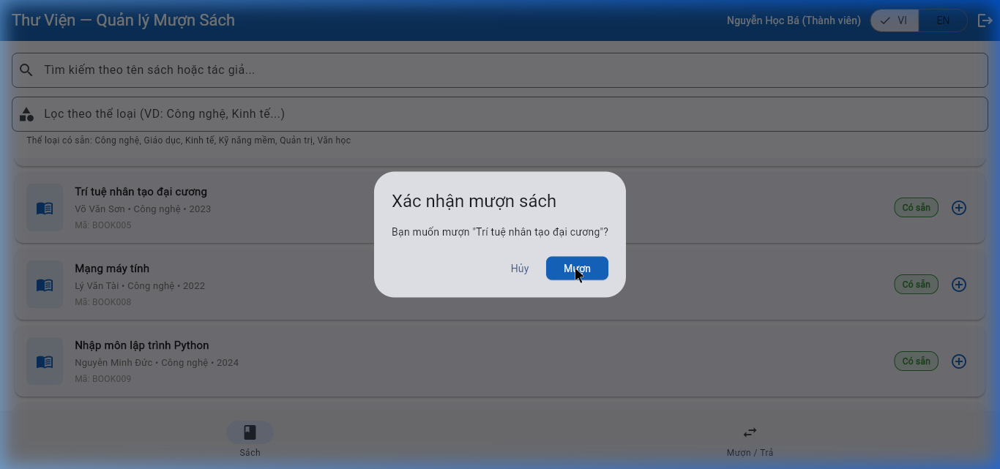

# Bug Reports — Báo cáo lỗi

> **Hướng dẫn**: Với mỗi TC bị **Fail** ở bước thực thi, hãy viết một Bug Report hoàn chỉnh vào file này. Xem [examples/sample-bug-report.md](../examples/sample-bug-report.md) để biết cách viết.

---

## BUG-001: Thành viên có thể mượn quá giới hạn 3 cuốn sách cùng lúc

**1. Thông tin chung**
- **Test Case bị Fail**: TC-17
- **Yêu cầu (REQ) liên quan**: REQ-04 (Giới hạn mượn sách)
- **Mức độ nghiêm trọng (Severity)**: High
  *(Giải thích: Lỗi này vi phạm trực tiếp luồng nghiệp vụ cốt lõi, khiến thành viên có thể gom hết sách của thư viện, ảnh hưởng nghiêm trọng đến vận hành)*
- **Môi trường**: Chrome / Windows (https://stqa.rbc.vn)

**2. Các bước tái hiện (Steps to Reproduce)**
1. Mở trình duyệt và truy cập hệ thống tại `https://stqa.rbc.vn`.
2. Đăng nhập bằng tài khoản Thành viên `ba.nguyen@email.com` (mật khẩu: `password123`).
3. Xác nhận ở Tab "Mượn/Trả" rằng thành viên này đã có sẵn một vài cuốn sách đang mượn (VD: 2 cuốn).
4. Chuyển sang Tab "Sách", mượn thêm sách cho đến khi đạt mức 3 cuốn.
5. Tiếp tục nhấn nút (+) để mượn thêm cuốn thứ 4 (Ví dụ: `BOOK005`).

**3. Kết quả thực tế (Actual Result)**
Hệ thống hiển thị thông báo mượn thành công và thêm cuốn sách thứ 4 vào danh sách đang mượn của thành viên. 

**4. Kết quả mong đợi (Expected Result)**
Theo REQ-04, hệ thống phải từ chối yêu cầu mượn cuốn thứ 4 và hiển thị thông báo lỗi vượt quá giới hạn 3 cuốn sách.

**5. Đề xuất / Khuyến nghị (Recommendation)**
Logic điều khiển cần thực hiện kiểm tra `currentBorrowedBooksCount >= 3` trước khi thực thi hàm mượn sách. Nút bấm Mượn sách cũng nên bị vô hiệu hóa (disabled) nếu người dùng đã đạt giới hạn.

---
