# Bug Reports

> **Hướng dẫn**: Tạo 1 mục bug cho mỗi TC có kết quả **Fail**.
> Xem [examples/sample-bug-report.md](../examples/sample-bug-report.md) để hiểu cách viết bug report tốt.
> Mỗi bug cần: tiêu đề mô tả hành vi lỗi, bước tái hiện, expected vs actual, severity + giải thích.

| Information | |
|---|---|
| **Group** | STQA_GROUP_05 |
| **Date created** | 23/05/2026 |

---

## BUG-01 - Login form displays an incorrect validation message when the email field is empty and the password field is filled

| **Attribute** | **Details** |
| --- | --- |
| **Bug ID** | BUG-01 |
| **Related TC** | TC-06 |
| **Related Requirement** | REQ-01 |
| **Severity** | Low |
| **Reported by** | Nguyễn Quang Vũ Hoàng |
| **Reported date** | 19/05/2026 |
| **Status** | Open |

**Environment:**

- Browser: Chrome
- Operating System: Linux
- Interface Language: Vietnamese, English
- System: <https://stqa.rbc.vn>

**Precondition:**

- The user is on the Login page.
- No user is currently logged in.

**Steps to Reproduce:**

1. Navigate to the Login page.
2. Leave the Email field empty.
3. Enter `admin123` into the Password field.
4. Click the **Login** button.

**Expected Result:**
The system should display the validation message: `Please enter email`.

**Actual Result:**
The system displays the validation message: `Please enter email and password`.

**Impact:**
The incorrect validation message may confuse users, but the login function still works correctly.

**Evidence:**

- Screenshot: 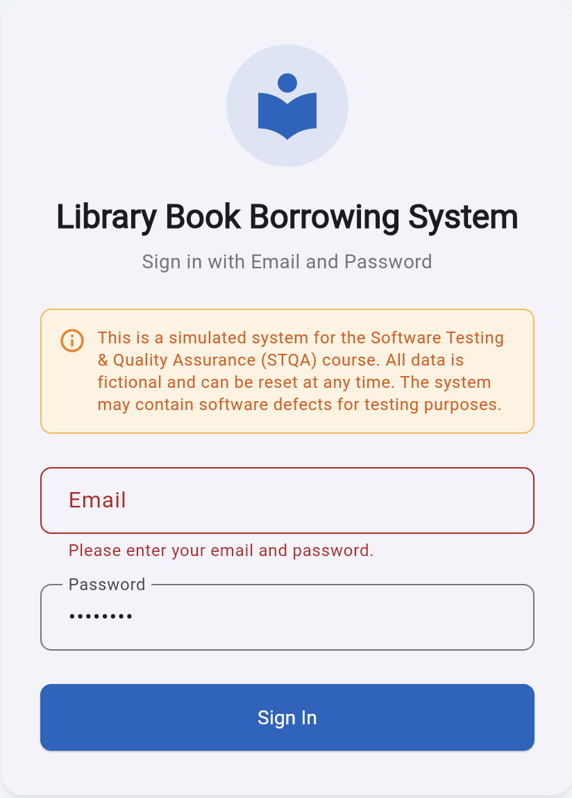

**Suggested Fix:**
Update the login validation logic to check each empty field separately:

- If both email and password are empty, display `Please enter email and password`.
- If only the email field is empty, display `Please enter email`.
- If only the password field is empty, display `Please enter password`.

---

## BUG-02 - Login form displays an incorrect validation message when the password field is empty and the email field is filled

| **Attribute** | **Details** |
| --- | --- |
| **Bug ID** | BUG-02 |
| **Related TC** | TC-07 |
| **Related Requirement** | REQ-01 |
| **Severity** | Low |
| **Reported by** | Nguyễn Quang Vũ Hoàng |
| **Reported date** | 19/05/2026 |
| **Status** | Open |

**Environment:**

- Browser: Chrome
- Operating System: Linux
- Interface Language: Vietnamese, English
- System: <https://stqa.rbc.vn>

**Precondition:**

- The user is on the Login page.
- No user is currently logged in.

**Steps to Reproduce:**

1. Navigate to the Login page.
2. Enter `librarian@library.com` into the Email field.
3. Leave the Password field empty
4. Click the **Login** button.

**Expected Result:**
The system should display the validation message: `Please enter password`.

**Actual Result:**
The system displays the validation message: `Please enter email and password`.

**Impact:**
The incorrect validation message may confuse users, but the login function still works correctly.

**Evidence:**

- Screenshot: 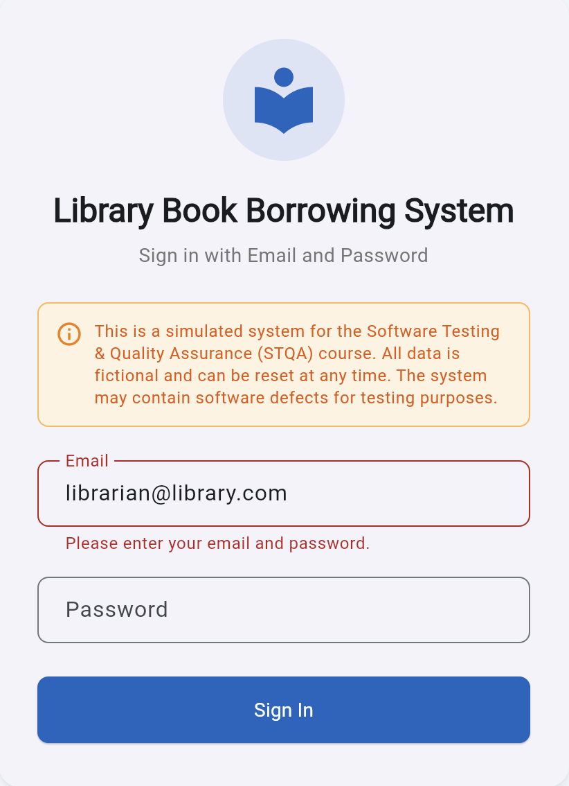

**Suggested Fix:**
Update the login validation logic to check each empty field separately:

- If both email and password are empty, display `Please enter email and password`.
- If only the email field is empty, display `Please enter email`.
- If only the password field is empty, display `Please enter password`.

---

## BUG-03 - Member Can Borrow More Than the 3-Book Limit at the Same Time

| **Attribute** | **Details** |
| --- | --- |
| **Bug ID** | BUG-03 |
| **Related TC** | [Placeholder] |
| **Related Requirement** | REQ-04 |
| **Severity** | High |
| **Reported by** | [Placeholder] |
| **Reported date** | [Placeholder] |
| **Status** | Open |

**Environment:**

- Browser: Chrome
- Operating System: [Placeholder]
- Interface Language: Vietnamese, English
- System: <https://stqa.rbc.vn>

**Precondition:**

- The member already has 1 book currently borrowed (BR001 - BOOK003).

**Steps to Reproduce:**

1. Open the browser and navigate to the system at `https://stqa.rbc.vn`.
2. Log in with member account `ba.nguyen@email.com` (password: `password123`).
3. Confirm in the "Borrow/Return" tab that this member already has 1 book currently borrowed (BR001 — BOOK003).
4. Switch to the "Books" tab and borrow 2 more available books (e.g., BOOK001, BOOK002) to reach a total of 3.
5. Continue pressing the (+) button to borrow a 4th book (e.g., `BOOK004` or `BOOK005`).
6. In the confirmation dialog, click "Borrow".

**Expected Result:**
Per REQ-04, the system must reject the request to borrow the 4th book and display an error message indicating the 3-book borrowing limit has been exceeded.

**Actual Result:**
The system displays a "Borrow successful!" message (green) and adds the 4th book to the member's active borrow list. No warning or blocking action is triggered by the system.

**Impact:**
This bug directly violates the core business flow, allowing members to hoard all books in the library, severely impacting library operations.

**Evidence:**

- Screenshot: 

**Suggested Fix:**
The control logic should implement a `currentBorrowedBooksCount >= 3` check before executing the borrow function. The Borrow button should also be disabled if the user has already reached the limit.

---

## BUG-04 - The system displays an incorrect validation message when the suspended member borrows a book

| **Attribute** | **Details** |
| --- | --- |
| **Bug ID** | BUG-04 |
| **Related TC** | TC-18 |
| **Related Requirement** | REQ-04 |
| **Severity** | Medium |
| **Reported by** | Nguyễn Hoàng Minh |
| **Reported date** | 20/05/2026 |
| **Status** | Open |

**Environment:**

- Browser: Chrome
- Operating System: Windows
- Interface Language: Vietnamese, English
- System: <https://stqa.rbc.vn>

**Precondition:**

- The user is logged in as a suspended member

**Steps to Reproduce:**

1. Navigate the Login page
2. Enter `cu.le@email.com` into Email field
3. Enter `password123` into Password field
4. Click the Login button
5. Select an `Available` book
6. Click the Borrow button

**Expected Result:**
The system rejects the borrow action and displays the error message: "Member suspended. Cannot borrow book".

**Actual Result:**
The system rejects the borrow action but displays the error message: "Member expired. Cannot borrow book".

**Impact:**
The incorrect message may confuse users and librarians about the actual reason why the borrow action is rejected.

**Evidence:**

- Screenshot: 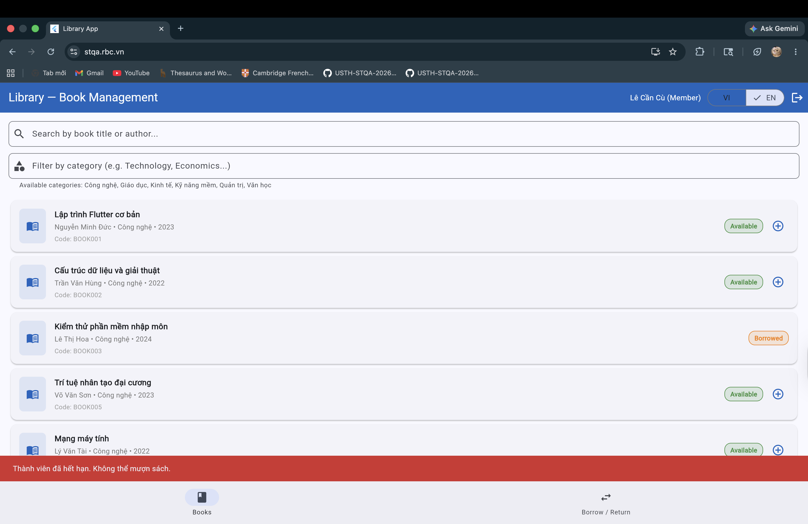

**Suggested Fix:**
Update the borrow book validation logic to check each member status separately:

- If member is suspended, reject borrowing book and display "Member suspended"
- If member is expired, reject borrowing book and display "Member expired"

---

## BUG-05 - Overdue book is returned successfully without displaying an overdue warning

| **Attribute** | **Details** |
| --- | --- |
| **Bug ID** | BUG-05  |
| **Related TC** | TC-22  |
| **Related Requirement** | REQ-05  |
| **Severity** | Medium |
| **Reported by** | Nguyễn Quang Vũ Hoàng |
| **Reported date** | 19/05/2026 |
| **Status** | Open |

**Environment:**

- Browser: Chrome
- Operating System: Linux
- Interface Language: Vietnamese, English
- System: <https://stqa.rbc.vn>

**Precondition:**

- The user is logged in as an active member.
- The member has an active borrow record with a due date earlier than the return date.
- Borrow record `BR001` exists and is overdue.

**Steps to Reproduce:**

1. Navigate to the Login page.
2. Log in with email `ba.nguyen@email.com` and password `password123`.
3. Open the `Borrow / Return` tab.
4. Click `Return book` for borrow record `BR001`.

**Expected Result:**
The book is returned successfully, and the system displays an overdue warning for the borrow record.

**Actual Result:**
The book is returned successfully and the return date is displayed, but no overdue warning is shown.

**Impact:**
Users may not be informed that the returned book was overdue.

**Evidence:**

- Screenshot: 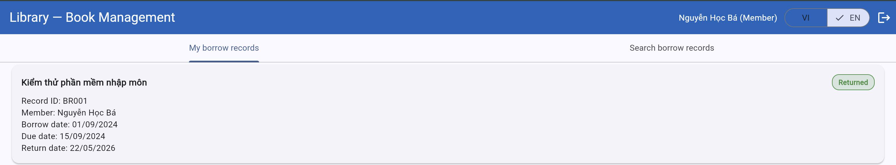

**Suggested Fix:**
Update the return book logic to check whether the return date is later than the due date. If `return date > due date`, the system should display an overdue warning after the book is returned.

---

## BUG-06 - Member can return another member's borrowed book successfully

| **Attribute** | **Details** |
| --- | --- |
| **Bug ID** | BUG-06  |
| **Related TC** | TC-23  |
| **Related Requirement** | REQ-05, REQ-08  |
| **Severity** | High |
| **Reported by** | Nguyễn Quang Vũ Hoàng, Nguyễn Hoàng Minh |
| **Reported date** | 19/05/2026 |
| **Status** | Open |

**Environment:**

- Browser: Chrome
- Operating System: Linux, Windows
- Interface Language: Vietnamese, English
- System: <https://stqa.rbc.vn>

**Precondition:**

- The user is logged in as member `MEM002`.
- Borrow record `BR003` belongs to another member, `MEM006`.
- Borrow record `BR003` is currently in `Borrowed` status.

**Steps to Reproduce:**

1. Navigate to the Login page.
2. Log in with email `ba.nguyen@email.com` and password `password123`
3. Open the `Borrow / Return` tab
4. Search borrow record of `MEM006`
5. Click `Return book` for the borrow record `BR003`

**Expected Result:**
The system rejects the return action, and borrow record `BR003` remains in `Borrowed` status.

**Actual Result:**
The system displays `Book returned successfully`, and the book status changes to `Available`.

**Impact:**
This bug allows a member to access and return another member’s borrow records, which violates user privacy and access control rules.

**Evidence:**

- Screenshot: 

**Suggested Fix:**
Update the return book logic to validate record ownership before allowing the return action:

- If the logged-in member owns the borrow record, allow the return action.
- If the borrow record belongs to another member, reject the action and display an access-denied message.

---

## BUG-07 - Add member failed although all input fields are valid

| **Attribute** | **Details** |
| --- | --- |
| **Bug ID** | BUG-07  |
| **Related TC** | TC-25  |
| **Related Requirement** | REQ-07  |
| **Severity** | Medium |
| **Reported by** | Vũ Minh Hoàng, Nguyễn Hoàng Minh |
| **Reported date** | 18/05/2026 |
| **Status** | Open |

**Environment:**

- Browser: Chrome
- Operating System: Linux, Windows
- Interface Language: Vietnamese, English
- System: <https://stqa.rbc.vn>

**Precondition:**

- The user is logged in as `Librarian`
- Full name, Email, Phone number are valid and satisfy the requirements

**Steps to Reproduce:**

1. Navigate to the Login page
2. Log in with email `librarian@library.com` and password `admin123`
3. Click the `Add member` button
4. Enter Full name: `Nguyen Test`, Email: `testnewuser99@gmail.com`, Phone number: `0901234567`
5. Click `Add member`

**Expected Result:**
New member added successfully, member code is generated and displayed

**Actual Result:**
Add member failed and system displayed "Invalid email"

**Impact:**
Librarians cannot add a valid new member to the system.

**Evidence:**

- Screenshot: 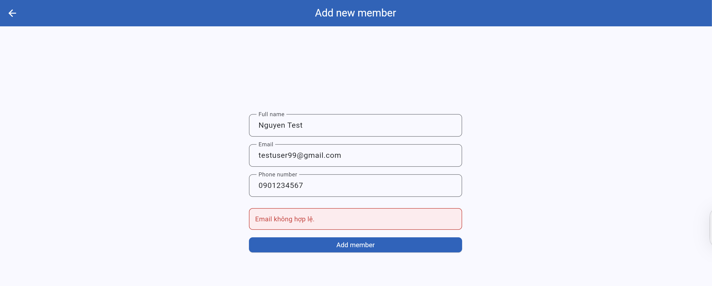

**Suggested Fix:**
Update the member creation validation logic to correctly accept valid email formats. The email `testnewuser99@gmail.com` should be recognized as valid, and the system should allow the member to be added successfully.

---

## BUG-08 - Adding a member successfully although email format is invalid

| **Attribute** | **Details** |
| --- | --- |
| **Bug ID** | BUG-08  |
| **Related TC** | TC-26 |
| **Related Requirement** | REQ-07 |
| **Severity** | Medium |
| **Reported by** | Nguyễn Quang Vũ Hoàng, Nguyễn Hoàng Minh |
| **Reported date** | 19/05/2026 |
| **Status** | Open |

**Environment:**

- Browser: Chrome
- Operating System: Linux, Windows
- Interface Language: Vietnamese, English
- System: <https://stqa.rbc.vn>

**Precondition:**

- The user is logged in as `Librarian`
- Full name, Phone number are valid and satisfy the requirements
- Email is invalid, missing `.` in the domain part

**Steps to Reproduce:**

1. Navigate to the Login page
2. Log in with email `librarian@library.com` and password `admin123`
3. Click the `Add member` button
4. Enter Full name: `Test Invalid`, Email: `new@gmail`, Phone number: `0901234567`
5. Click `Add member`

**Expected Result:**
The system rejects member creation and displays email format error message

**Actual Result:**
The system creates member successfully and displays message: `Member added successfully! ID: MEM007`

**Impact:**
The system allows invalid member data to be stored

**Evidence:**

- Screenshot:  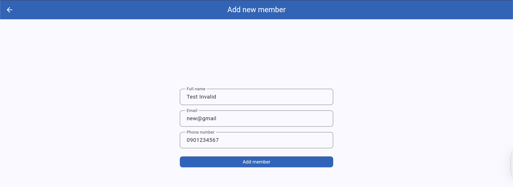 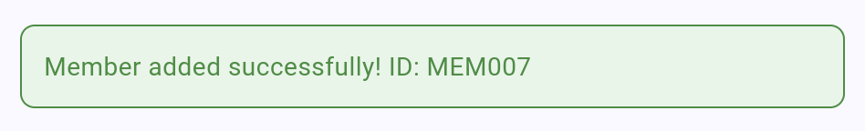 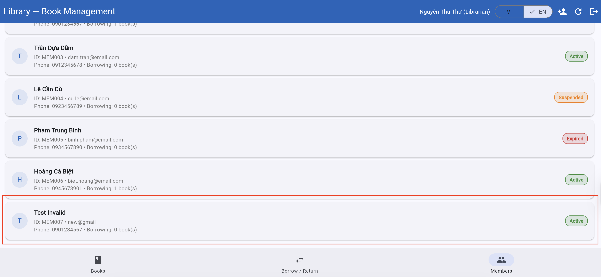

**Suggested Fix:**
Update the member creation validation logic to reject invalid email formats. The email `new@gmail` should be recognized as invalid because the domain part is incomplete, and the system should not allow the member to be added successfully.

---

## BUG-09 - Adding member form displays an incorrect validation message when entering duplicate email in existing accounts

| **Attribute** | **Details** |
| --- | --- |
| **Bug ID** | BUG-09 |
| **Related TC** | TC-27 |
| **Related Requirement** | REQ-07 |
| **Severity** | Medium |
| **Reported by** | Nguyễn Hoàng Minh |
| **Reported date** | 20/05/2026 |
| **Status** | Open |

**Environment:**

- Browser: Chrome
- Operating System: Windows
- Interface Language: Vietnamese, English
- System: <https://stqa.rbc.vn>

**Precondition:**

- The user is logged in as `Librarian`
- Full name and Phone number are valid and satisfy the requirements
- The entered email already exists in the system

**Steps to Reproduce:**

1. Navigate to the Login page
2. Log in with email `librarian@library.com` and password `admin123`
3. Click the `Add member` button
4. Enter Full name: `Nguyen Duplicate`, Email: `librarian@library.com`, Phone number: `0901234567`
5. Click `Add member`

**Expected Result:**
The system rejects member creation and displays a duplicate email error message.

**Actual Result:**
Member creation fails, but the system displays `Invalid email`

**Impact:**
The incorrect validation message may confuse librarians about why the member cannot be added.
_This does not affect the duplicate email checking logic (tested by creating two `newuser@email` accounts and the checking logic works correctly)._

**Evidence:**

- Screenshot: 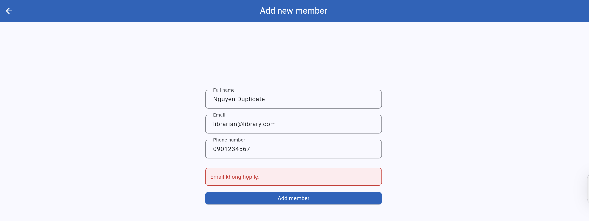

**Suggested Fix:**
Update the member creation validation logic to check email uniqueness separately from email format:

- If the email format is invalid, display `Invalid email`.
- If the email already exists, display `Email already exists. Please enter another email`.

---

## BUG-10 - Adding member form displays an incorrect validation message when leaving Phone number field empty

| **Attribute** | **Details** |
| --- | --- |
| **Bug ID** | BUG-10 |
| **Related TC** | TC-29 |
| **Related Requirement** | REQ-07  |
| **Severity** | Medium |
| **Reported by** | Vũ Minh Hoàng |
| **Reported date** | 18/05/2026 |
| **Status** | Open |

**Environment:**

- Browser: Chrome
- Operating System: Linux
- Interface Language: Vietnamese, English
- System: <https://stqa.rbc.vn>

**Precondition:**

- The user is logged in as Librarian
- Full name and Email are valid and satisfy the requirements
- Phone number field is left empty

**Steps to Reproduce:**

1. Navigate to the Login page
2. Log in with email `librarian@library.com` and password `admin123`
3. Click the `Add member` button
4. Enter Full name: `Nguyen Phone`, Email: `valid2@email.com`
5. Leave Phone number field empty
6. Click `Add member`

**Expected Result:**
The system rejects member creation and displays `Phone number must not be blank`

**Actual Result:**
Member creation fails, but the system displays `Invalid email`

**Impact:**
The incorrect validation message may confuse librarians about why the member cannot be added.

**Evidence:**

- Screenshot: 

**Suggested Fix:**
Update the member creation validation logic to check empty field separately:

- If only the Full name field is empty, display `Full name must not be blank`.
- If only the Email field is empty, display `Email must not be blank`.
- If only the Phone number field is empty, display `Phone number must not be blank`.

---

## BUG-11 - Adding member form displays an incorrect validation message when Phone number format is invalid

| **Attribute** | **Details** |
| --- | --- |
| **Bug ID** | BUG-11 |
| **Related TC** | TC-30 |
| **Related Requirement** | REQ-07 |
| **Severity** | Medium |
| **Reported by** | Vũ Minh Hoàng |
| **Reported date** | 18/05/2026 |
| **Status** | Open |

**Environment:**

- Browser: Chrome
- Operating System: Linux
- Interface Language: Vietnamese, English
- System: <https://stqa.rbc.vn>

**Precondition:**

- The user is logged in as `Librarian`
- Full name and Email are valid and satisfy the requirements
- Phone number contains letters

**Steps to Reproduce:**

1. Navigate to the Login page
2. Log in with email `librarian@library.com` and password `admin123`
3. Click the `Add member` button
4. Enter Full name: `Nguyen Character`, Email: `valid3@email.com`
5. Enter Phone number: `09abcde345`
6. Click Add member

**Expected Result:**
The system rejects member creation and displays `Invalid phone number`

**Actual Result:**
Member creation fails, but the system displays `Invalid email`

**Impact:**
The incorrect validation message may confuse librarians about why the member cannot be added.

**Evidence:**

- Screenshot: 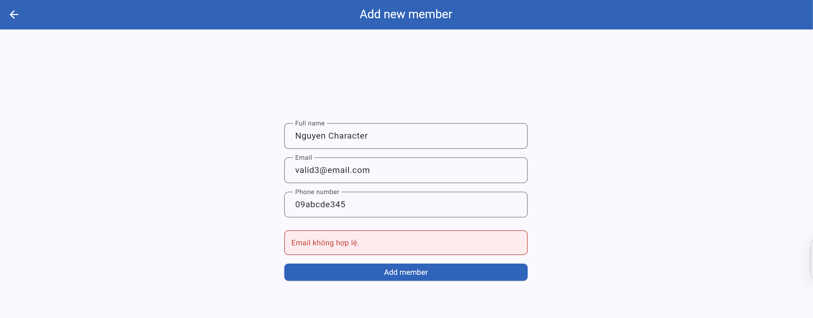

**Suggested Fix:**
Update the member creation validation logic to validate the phone number separately from the email:

- If the email format is invalid, display `Invalid email`
- If the phone number format is invalid, display `Invalid phone number`

---

## BUG-12 - Member can view another's borrow records by using search function

| **Attribute** | **Details** |
| --- | --- |
| **Bug ID** | BUG-12 |
| **Related TC** | TC-31, TC-33 |
| **Related Requirement** | REQ-08 |
| **Severity** | High |
| **Reported by** | Nguyễn Quang Vũ Hoàng |
| **Reported date** | 19/05/2026 |
| **Status** | Open |

**Environment:**

- Browser: Chrome
- Operating System: Linux
- Interface Language: Vietnamese, English
- System: <https://stqa.rbc.vn>

**Precondition:**

- The user is logged in as member `MEM002`.
- Member `MEM006` has existing borrow records.
- A member should only be allowed to view their own borrow records.

**Steps to Reproduce:**

1. Navigate to the Login page.
2. Log in with email `ba.nguyen@email.com` and password `password123`.
3. Open the `Borrow / Return` tab.
4. Click `My borrow records`.
5. Observe that only records belonging to `MEM002` are displayed.
6. Use the `Search borrow record` function.
7. Enter member ID `MEM006`.
8. Click `Search` button.

**Expected Result:**
The system should reject the lookup or hide the records of `MEM006`. Member `MEM002` should only be able to view their own borrow records.

**Actual Result:**
The system displays borrow records belonging to `MEM006` after member `MEM002` searches for member ID `MEM006`.

**Impact:**
This bug allows members to access other members’ borrow records without permission, violating access control and user privacy.

**Evidence:**

- Screenshot: 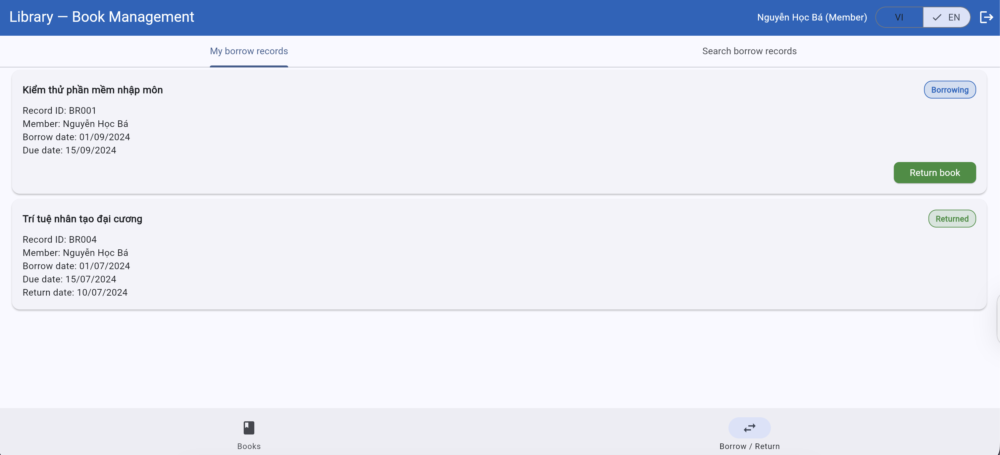 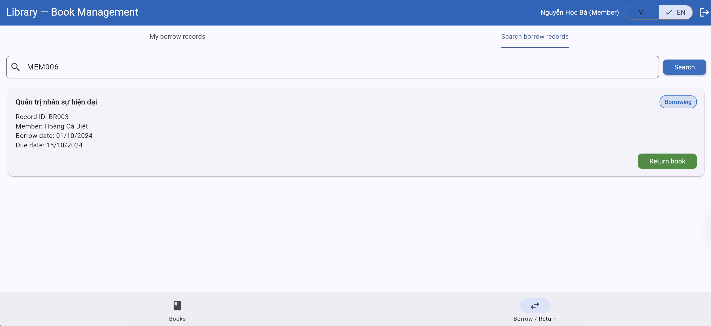

**Suggested Fix:**
Update the borrow record lookup logic to enforce role-based access control:

- If the user is a member, only allow them to view borrow records linked to their own member ID.
- If the user searches for another member’s ID, reject the request or display an access-denied message.
- If the user is a librarian, allow access to all members’ borrow records.
